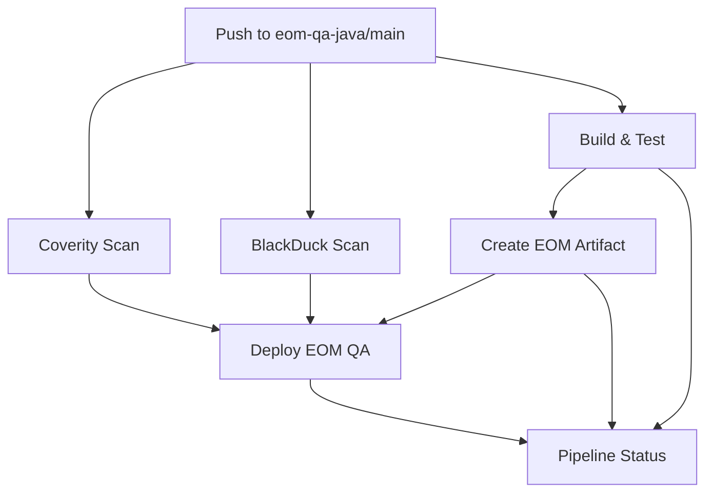

# 🎯 EOM QA Pipeline Documentation

## 📋 **Pipeline Overview**

Este pipeline está basado en la estructura de `test01.yml` y adaptado para crear **artifacts EOM QA** con fecha y número de build únicos.

## 🏗️ **Pipeline Structure**

### **Jobs Implementados:**

1. **🔒 Coverity Scan** - Security scanning con Coverity
2. **🛡️ BlackDuck Scan** - Dependency vulnerability scanning  
3. **🧪 Build and Test** - Compilación y pruebas Selenium
4. **📦 Create EOM Artifact** - Creación del artifact con fecha
5. **🚀 Deploy EOM QA** - Deployment a Azure (solo main branch)
6. **📊 Pipeline Status** - Reporte final de estado

---

## 📦 **Artifact Structure**

El pipeline genera artifacts con el formato: **`eom-qa-{run_number}-{fecha}`**

### **Contenido del Artifact:**
```
eom-qa-{run_number}-{fecha}.zip
├── app/
│   └── eom-qa-app.jar              # Aplicación principal
├── config/
│   └── application.properties       # Configuración
├── docs/
│   └── README.md                   # Documentación
├── qa-reports/
│   └── [test-results]              # Reportes de pruebas
├── start-eom-qa.bat               # Script de deployment
└── ARTIFACT-INFO.txt              # Información del artifact
```

---

## 🔄 **Pipeline Flow**



---

## ⚙️ **Configuration**

### **Environment Variables:**
- `RELEASE_VERSION`: `eom-qa-v1.0.{run_number}`
- `ARTIFACT_NAME`: `eom-qa-{run_number}-{date}`
- `EOM_QA_PROJECT`: `eom-qa-automation`
- `JAVA_VERSION`: `21`

### **Triggers:**
- **Push** a branches: `eom-qa-java`, `main`, `develop`
- **Pull Request** a: `eom-qa-java`, `main`
- **Manual Dispatch** con opciones:
  - Coverity Scan (on/off)
  - BlackDuck Scan (on/off)
  - Test Suite (all/selenium/api/security/performance)
  - Browser (chrome/firefox/edge)

### **Runners:**
- **Security & Build**: `App-Factory-Win-2019`
- **Status & Reports**: `ubuntu-latest`

---

## 🧪 **Testing Features**

### **Selenium Tests:**
- ✅ Multi-browser support (Chrome, Firefox, Edge)
- ✅ Headless testing capability
- ✅ Screenshot capture on failures
- ✅ Test result artifacts (90 days retention)

### **QA Test Suites:**
- `all` - Todas las pruebas
- `selenium` - Pruebas de UI
- `api` - Pruebas de API endpoints
- `security` - Pruebas de seguridad
- `performance` - Pruebas de rendimiento

---

## 🔐 **Security Integration**

### **Coverity Integration:**
```yaml
- name: Run Coverity Security Scans
  run: |
    Write-Host "🔒 EOM QA - Running Coverity Security Scan"
    Write-Host "Project: $env:EOM_QA_PROJECT"
    Write-Host "Version: $env:RELEASE_VERSION"
    # .\.github\build\coverity.ps1
```

### **BlackDuck Integration:**
```yaml
- name: BlackDuck Security Scan
  run: |
    Write-Host "🛡️ EOM QA - Running BlackDuck Security Scan"
    mvn clean package -DskipTests
    # .\.github\build\blackduck.bat
```

---

## 📊 **Artifacts & Reports**

### **Generated Artifacts:**
1. **EOM QA Package**: `eom-qa-{run_number}-{date}.zip`
2. **QA Test Results**: Surefire reports, screenshots
3. **Pipeline Status**: Markdown report
4. **Security Reports**: Coverity & BlackDuck results

### **Retention Policies:**
- **Main Artifacts**: 90 days
- **Test Screenshots**: 7 days (on failure)
- **Status Reports**: 30 days

---

## 🚀 **Deployment Strategy**

### **Conditional Deployment:**
- Solo se ejecuta en branches `main` o `eom-qa-java`
- Requiere que pasen todos los security scans
- Deployment automático a Azure con BeyondTrust secrets

### **Deployment Process:**
1. Download EOM QA artifact
2. Extract deployment package
3. Deploy to Azure environment
4. Generate deployment report

---

## 🎛️ **Manual Execution**

### **Workflow Dispatch Parameters:**
```yaml
inputs:
  run_coverity: boolean (default: true)
  run_blackduck: boolean (default: true)  
  test_suite: choice (all/selenium/api/security/performance)
  browser: choice (chrome/firefox/edge)
```

### **Example Manual Run:**
1. Go to Actions tab in GitHub
2. Select "EOM QA Automation Pipeline"
3. Click "Run workflow"
4. Configure parameters as needed
5. Run pipeline

---

## 📈 **Monitoring & Notifications**

### **PR Comments:**
- Automatic test result comments on Pull Requests
- Status updates with links to detailed reports

### **Status Reporting:**
- Comprehensive pipeline status markdown
- Individual job result tracking
- Artifact creation confirmation

---

## 🔧 **Customization Points**

### **To Customize for Different Projects:**
1. Update `EOM_QA_PROJECT` environment variable
2. Modify artifact naming in `ARTIFACT_NAME`
3. Adjust retention days as needed
4. Update deployment target in Azure step

### **Adding New Test Suites:**
1. Add to `test_suite` choices in workflow_dispatch
2. Add corresponding conditional step in build_and_test job
3. Update documentation

---

## ✅ **Verification Checklist**

- [ ] Pipeline triggers on correct branches
- [ ] Security scans execute (Coverity & BlackDuck)
- [ ] Selenium tests run successfully
- [ ] Artifact created with correct naming
- [ ] Deployment executes on main branch only
- [ ] Status reports generated
- [ ] Artifacts uploaded with proper retention

---

## 🎉 **Success Criteria**

The pipeline is considered successful when:
1. ✅ All security scans pass
2. ✅ Selenium tests execute without critical failures  
3. ✅ EOM QA artifact created and uploaded
4. ✅ Deployment completes (if applicable)
5. ✅ Status report generated

---

**Pipeline Created**: $(Get-Date -Format 'yyyy-MM-dd')
**Based on**: test01.yml structure
**Target**: EOM QA Automation Framework
**Artifact Format**: eom-qa-{run_number}-{date}