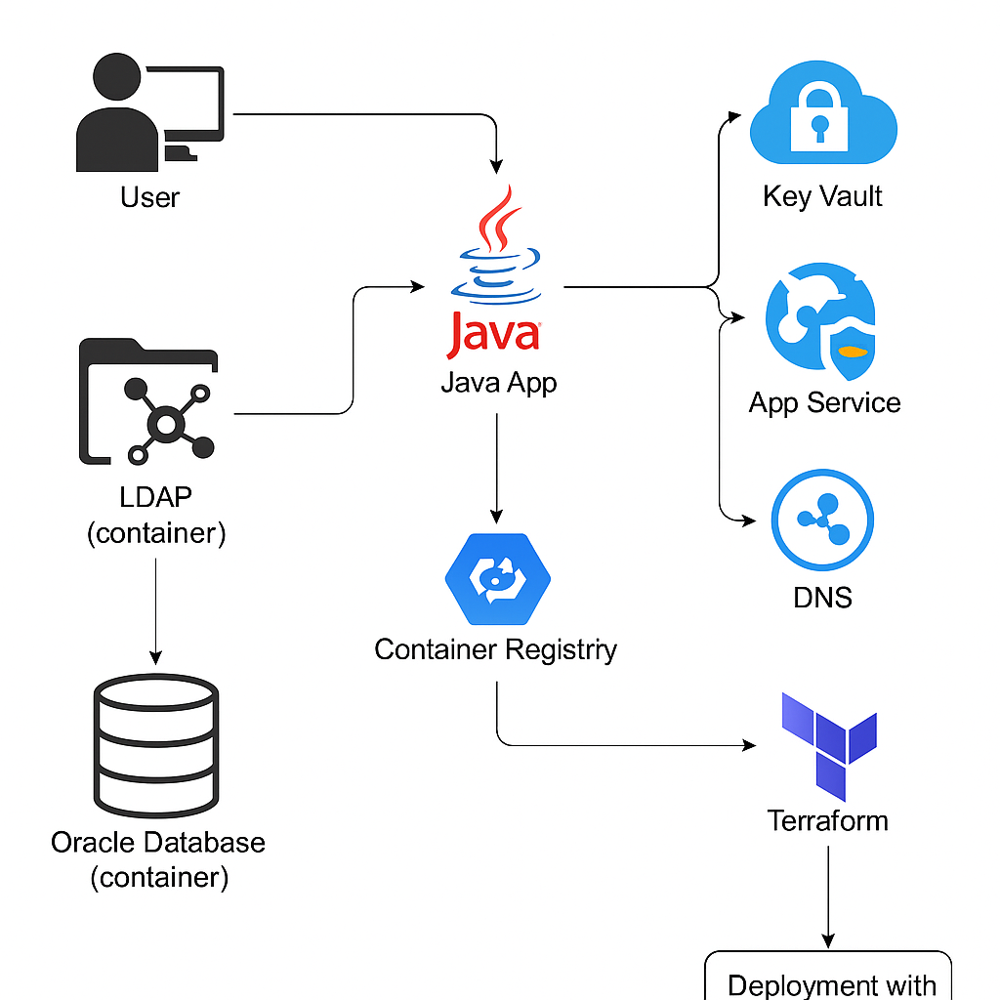

# Spring Boot + LDAP + Oracle on Azure

## 🖼️ Architecture Overview



## 📦 Project Structure
```
springboot-ldap-oracle-azure/
├── app/                       # Java Spring Boot app with LDAP
├── ldap/                      # OpenLDAP container and users.ldif
├── oracle/                    # Oracle XE container and init SQL
├── terraform/                 # Infrastructure as Code
├── selenium/                  # Automated test scripts
├── .github/workflows/         # GitHub Actions CI/CD
├── architecture.md            # Text explanation
├── architecture_diagram_professional.png  # Visual diagram
```
# 📝 Overview: Spring Boot + LDAP + Oracle on Azure

This solution demonstrates a secure, scalable, and modular Java web application running on Azure using Spring Boot, LDAP authentication, Oracle DB, and containerization.

---

## 📦 Components

- **Java App:** Spring Boot REST API authenticating against OpenLDAP
- **LDAP Server:** OpenLDAP with preconfigured users (`users.ldif`)
- **Oracle DB:** Oracle XE running in a container
- **Terraform Modules:** Deploys Azure infrastructure (ACR, App Service, DNS, etc.)
- **CI/CD:** GitHub Actions optional workflow for automated deployment
- **Testing:** REST-based and browser-based validation via Selenium

---

## 🚀 Usage Steps

### 1. Run Locally (Dev)
```bash
cd springboot-ldap-oracle-azure
./start.sh    # Or start.ps1 on Windows
```

### 2. Compile the Java App
```bash
cd app
./mvnw clean package
```

### 3. Push to Azure Container Registry (ACR)
```bash
az login
az acr login --name <acr_name>
docker build -t <acr_name>.azurecr.io/app:latest ./app
docker push <acr_name>.azurecr.io/app:latest
```

### 4. Deploy to Azure with Terraform
```bash
cd terraform
terraform init
terraform apply -var-file="terraform.tfvars"
```

---

## 🔒 User Authentication Test

- **Username:** `domiuser1`
- **Password:** `secret123`

### Test with CURL or browser:
```bash
curl -X POST http://localhost:8080/login \
  -H "Content-Type: application/json" \
  -d '{"username":"domiuser1","password":"secret123"}'
```

Expected response:
```
Hello World, you are Authenticated on Web-Java-Oracle LDAP
```

---

## 🧪 Automated Testing (Optional)

### REST-based
```bash
cd selenium
python3 test_login.py
```

### Browser-based
```bash
python3 test_login_browser.py
```

---

## 🌐 DNS and Access

- You can configure a custom domain like `https://login.domi.local` using Azure DNS.
- If not configured, fallback to the App Service’s public IP or FQDN.

---

## 📚 Additional Recommendations

- Use Azure Key Vault for secrets
- Enable TLS (HTTPS and LDAPS)
- Monitor and scale App Service Plan
- Replace basic auth with JWT in production

---

## 🚀 How to Use

See the included presentation PDF or architecture.md for full instructions.

- `start.sh` / `start.ps1` to launch locally
- `terraform apply` to deploy to Azure
- `test_login.py` and `test_login_browser.py` for automated verification

